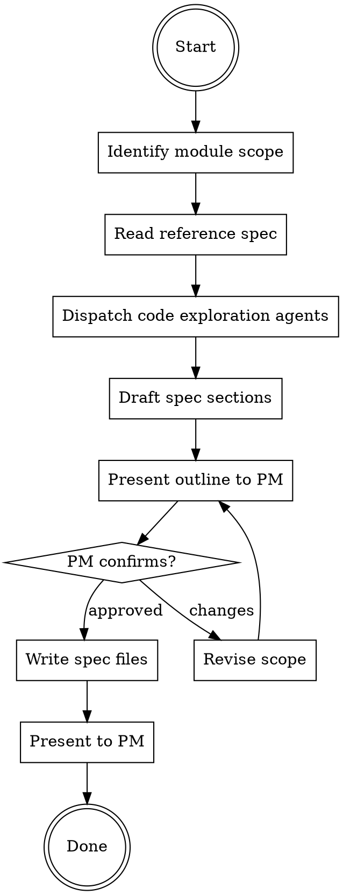

# Generate Product Spec

Read source code and produce a product spec documenting **what the system currently does**. The spec is the SSOT (Single Source of Truth) for a module's behavior — PRDs reference it as baseline.

## Rules

- Respond in Traditional Chinese
- Spec documents **current behavior**, not aspirational design
- Every claim must trace to actual source code
- Use `specs/{domain}/spec.md` format following existing specs as template
- PM confirms before writing — do NOT write without review

## Workflow



### Step 1: Identify Module Scope

Ask PM (if not specified):
1. Which module? (e.g., prize, openapi, journey, broadcast)
2. Frontend, backend, or both?
3. Which repo directories contain the module code?

**Scope lock-in:** The spec covers ONE module. If PM asks for multiple modules, write separate specs — one per module. Never combine unrelated modules into one spec.

### Step 2: Read Reference Spec

Read an existing product spec as format template:
1. `specs/journey/spec.md` — main spec structure
2. One capability file (e.g., `specs/journey/capabilities/lifecycle.md`) — REQ/Scenario format

Extract the template structure (do NOT copy Journey-specific content):
- Frontmatter format (`domain`, `updated`, `source_files`, `parent`)
- Section numbering and headings
- REQ naming convention (`REQ-{PREFIX}-{NNN}`)
- Scenario format (GIVEN/WHEN/THEN with explicit Actor names)
- Data model format (behavior-level ASCII tree, not DB schema)
- Constraints table format

### Step 3: Dispatch Code Exploration Agents

Dispatch **parallel subagents** (using Agent tool) to read source code. Each agent explores one layer and reports findings in a structured format.

Repo paths come from Step 1 (PM specifies directories). If PM only names the module, search for it:
- Backend: `{repo}/{module}/` (e.g., `rubato/prize/`, `rubato/openapi/`)
- Frontend: `{frontend_repo}/src/pages/{Module}/` or similar

**Always dispatch these 3 agents in parallel:**

#### Agent 1: Models & Constants

```
Read all model files and constants for the {module} module.

Files to find and read:
- {repo}/{module}/models.py (or models/ directory)
- {repo}/{module}/constants.py
- {repo}/{module}/enums.py (if exists)
- Related model files imported by the module

For each model, document:
- Model name and purpose (one line)
- All fields: name, type, constraints (nullable, unique, max_length, default)
- Relationships: FK, M2M, OneToOne — with related model names
- Indexes and unique constraints
- Status/lifecycle constants with numeric values
- Any computed properties or model methods that encode business logic

For constants/enums:
- All constant names, values, and what they mean
- Group by category (status, type, mode, etc.)

Output as structured markdown tables.
```

#### Agent 2: Services & Domain Logic

```
Read all service files and domain logic for the {module} module.

Files to find and read:
- {repo}/{module}/services/ (all files)
- {repo}/{module}/domains/ (all files)
- {repo}/{module}/tasks.py or tasks/ (Celery tasks)
- {repo}/{module}/signals.py (if exists)

For each service/domain method:
- Method signature (full, with type hints)
- Constructor dependencies (injected services/repos)
- What it does (step by step, 3-5 bullets)
- Status transitions it performs
- Side effects (async tasks, events published, external calls)
- Exceptions raised (name + when)
- Concurrency handling (locks, select_for_update, cache locks)

For Celery tasks:
- Task name, what triggers it, what it does
- Retry policy if any

Output as structured markdown.
```

#### Agent 3: API Layer (Views, URLs, Serializers)

```
Read all API-facing code for the {module} module.

Files to find and read:
- {repo}/{module}/views.py or views/ directory
- {repo}/{module}/urls.py or urls/ (include parent URL conf if routed)
- {repo}/{module}/serializers.py or serializers/
- {repo}/{module}/permissions.py (if exists)
- {repo}/{module}/filters.py (if exists)

For each endpoint:
- HTTP method + URL pattern (full path from root)
- ViewSet/View class and action name
- Permission classes
- Request serializer fields (with validation rules)
- Response serializer fields
- Business logic summary (which service/domain method is called)
- Error responses (status code + error format)
- Pagination/filtering if applicable

For authentication:
- Auth class(es) used
- Token format and validation flow

Output as structured markdown tables.
```

#### Agent 4: Cross-Module Boundary Check (always dispatch)

```
Search for code in OTHER modules that calls into or exposes the {module} module.

Strategies:
- Grep for imports of {module} models/services/controllers across the entire repo
- Check openapi/ views for endpoints that wrap {module} functionality
- Check other modules' controllers/services for calls to {module} services
- Check URL routing for external-facing endpoints related to {module}

For each cross-module touchpoint:
- Calling module and file path
- What it calls (function/class name)
- Purpose (why the other module uses {module})
- Any wrapper logic or transformations applied

This identifies Integration Points the main agents might miss.
Output as a markdown table: Caller Module | File | Calls | Purpose
```

#### Optional Agent 5: Frontend (if "both" or "frontend" scope)

```
Read all frontend code for the {module} module.

Files to find and read:
- {frontend_repo}/src/pages/{Module}/ or similar
- {frontend_repo}/src/api/ related endpoints
- {frontend_repo}/src/components/ related to module
- Route definitions referencing this module

For each page/component:
- Component name and purpose
- Route path
- API calls made (endpoint + method)
- Key UI states (loading, empty, error, success)
- User interactions and their effects

Output as structured markdown.
```

### Step 4: Draft Spec Outline

Synthesize agent findings into an **outline** (not the full spec yet). Structure:

```markdown
## Proposed Spec Structure: {Module Name}

### Main Spec (`specs/{domain}/spec.md`)
1. Overview — {1-2 sentence summary}
2. Glossary — {list of terms to define}
3. Actors — {list of actors}
4. Data Model — {list of models with key fields}
5. Lifecycle — {state machine if applicable}
6. Capabilities — {list of capability files}
7. Integration Points — {adjacent domains}
8. Out of Scope — {what this spec does NOT cover}
9. Constraints — {key limits from constants}
10. Changelog

### Capability Files
- `capabilities/{name}.md` — {scope}
- ...

### Source Files (frontmatter)
- {list of source files read}

### Open Questions
- {anything unclear from code reading}
```

**Present this outline to PM before writing.** Ask:
- Is the scope correct?
- Any capabilities missing or should be split/merged?
- Any actors or integration points to add?

### Step 5: Write Spec Files

After PM approval, write the spec files.

**Frontmatter format:**

```yaml
---
domain: {module}
updated: {today YYYY-MM-DD}
source_files:
  - {exact file paths read}
---
```

**Capability file frontmatter:**

```yaml
---
domain: {module}
capability: {name}
updated: {today YYYY-MM-DD}
source_files:
  - {files for this capability}
parent: ../spec.md
---
```

**Writing rules:**

| Section | Rule |
|---------|------|
| Data Model | Behavior-level ASCII tree. Only fields referenced in scenarios. NOT a DB schema dump. |
| Lifecycle | State machine ASCII diagram. Transitions with preconditions and domain methods. |
| Requirements | `REQ-{PREFIX}-{NNN}` format. **Every scenario MUST live under a numbered REQ.** One requirement per distinct behavior. PRDs reference specs by REQ ID — unnumbered scenarios cannot be referenced. |
| Scenarios | GIVEN/WHEN/THEN with explicit Actor name. Specific values, not vague descriptions. |
| Constraints | Table with Constraint / Value / Scope columns. Reference constant names from code. |
| Integration Points | Table with Adjacent domain / This module's use / Direction columns. |
| Out of Scope | Explicit list of what this spec does NOT cover, with owner domain if known. |
| Open Questions | List anything unclear from code reading. Mark with `<!-- source: file:line -->` so PM can investigate. Do NOT silently skip ambiguous behavior — make it visible. |

**REQ numbering is mandatory.** Example:

```markdown
### REQ-PRIZE-003: Claim a prize via UID flow

Subscriber SHALL be able to claim a prize...

#### Scenario: Claiming when stock is exhausted
- **GIVEN** Subscriber accesses the LIFF with a UID-based key
- **AND** the Prize Setting has no UNOWNED prizes remaining
- **WHEN** the claim request is processed
- **THEN** a `PrizeNotEnough` error is raised
```

**Scenario Actor convention:** Always use explicit actors from Glossary. Never "the system" or "the user" — use "Marketing Operator", "System Scheduler", "Subscriber", etc.

**Capability file split rule:**

- Main spec (`spec.md`): Overview, Glossary, Actors, Data Model, Lifecycle, Capabilities index (one-line summary + link per capability), Integration Points, Out of Scope, Constraints, Changelog
- Capability files (`capabilities/{name}.md`): REQs and Scenarios for that capability
- **Split threshold:** If a capability has 3+ REQs or 5+ scenarios, it gets its own file. Otherwise keep it in the main spec under §6.
- If the entire module is small (< 5 capabilities, < 15 scenarios total), a single `spec.md` with inline capabilities is acceptable.

### Step 6: Present to PM

After writing all files, present:
1. File list with brief description of each
2. Summary of key behaviors documented
3. Any open questions discovered during code reading
4. Reminder: PRDs should reference this spec as baseline

## Common Mistakes

| Mistake | Fix |
|---------|-----|
| Writing spec from PRD instead of code | Spec = current behavior from code. PRD = future changes. |
| Dumping all DB fields into Data Model | Only include fields referenced in scenarios. Behavior-level, not schema. |
| Skipping constants file | Constants define constraints and status values — always read them. |
| Vague scenarios ("user does something") | GIVEN/WHEN/THEN with explicit Actor, specific values, named exceptions. |
| Writing without PM reviewing outline | Always present outline first. PM may adjust scope. |
| Combining multiple modules in one spec | One module = one spec. Separate specs for separate modules. |
| Copying Journey spec content | Use Journey as format template only. Content comes from THIS module's code. |
| Skipping service-layer side effects | Document async tasks, events, tag assignments — not just status changes. |
| **Scenarios without REQ-XXX numbering** | Every scenario MUST be under a `REQ-{PREFIX}-{NNN}`. Without IDs, PRDs cannot reference specific behaviors. |
| **Everything in one file** | Use capability sub-files for capabilities with 3+ REQs. Main spec should be scannable index, not 600+ line monolith. |
| **Not checking cross-module boundaries** | Always dispatch Agent 4 (cross-module check). Other modules may expose your module's functionality (e.g., OpenAPI wrapping Prize endpoints). |
| **Silently skipping ambiguous code** | If code behavior is unclear, add to Open Questions section. Do NOT guess or omit — make it visible. |

## Red Flags — STOP and Re-read This Skill

- You're writing spec content without having read the actual source code
- You're describing what the system "should do" instead of "currently does"
- Your Data Model section looks like a Django model dump with every field
- Your Scenarios don't name a specific Actor
- You skipped the PM outline review and went straight to writing
- You're combining Prize + Open API (or any two modules) into one spec file
- **Your scenarios have no REQ-XXX IDs** — go back and number every one
- **Your spec.md is 500+ lines with no capability sub-files** — split it
- **You didn't dispatch the cross-module boundary agent** — go back to Step 3
