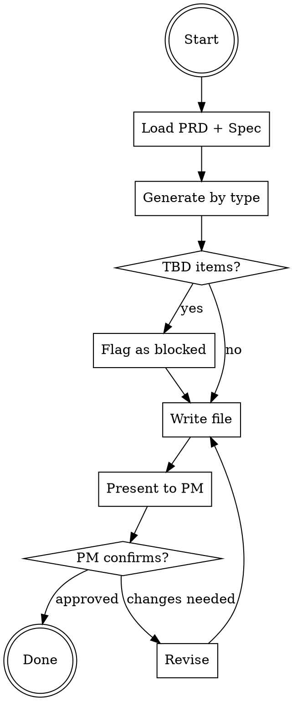

# Generate Test Cases

Generate structured, executable test cases from PRD content. Every test case must be specific enough for QA to judge pass/fail without ambiguity.

## Rules

- Respond in Traditional Chinese
- Test cases must be concrete, executable, and pass/fail judgable
- Cover all 4 types: Happy Path, Edge Cases, Error Handling, Regression
- Each run overwrites `prds/{name}/test-cases.md` to stay in sync with PRD
- `test-cases.md` defines test cases — do NOT use it for execution tracking (use `/test-run` for that)

## Workflow

### Step 1: Load Context

If PM didn't specify which PRD, list active PRDs in `prds/` (excluding `archive/`) and ask.

Read all of:
1. `prds/{name}/prd.md` — focus on User Stories, Acceptance Criteria, Spec Delta, Scope boundaries
2. `specs/{domain}/spec.md` (if exists) — for regression test derivation
3. `templates/test-cases-template.md` — output format

**Regression requires reading the spec.** If the PRD's domain has a spec, you MUST read it. Do not skip this because "it's a different domain" — verify first by checking the PRD's `domain` field in frontmatter.

### Step 2: Generate Test Cases

Generate test cases by type, using strict priority rules:

#### Priority Rules (not gut feel)

| Priority | Criteria | Examples |
|----------|----------|---------|
| **P0** | Core user flow that blocks launch if broken | Login success, coupon claim success, barcode display |
| **P1** | Important but has workaround or fallback | Error handling, edge cases with fallback UI, admin CRUD |
| **P2** | Low impact or rare occurrence | Cosmetic states, extreme boundary values, regression on unchanged areas |

#### Happy Path (P0)

Source: Each User Story's Acceptance Criteria — the first/positive GIVEN/WHEN/THEN.

Every User Story MUST produce at least one Happy Path test case. If a story has no Happy Path test case, you missed something.

#### Edge Cases (P1)

Source: Derive from these specific areas — do NOT skip any:
- Spec Delta boundary conditions
- Concurrent/multi-user scenarios
- Empty/null/zero/max values
- Cross-module interactions
- Time-boundary conditions (timezone, midnight rollover, expiry)

#### Error Handling (P1)

Source: Derive from these specific areas:
- Permission/auth failures
- External service failures (API timeout, 5xx)
- Invalid input (wrong format, too long, special characters)
- Race conditions (duplicate submit, concurrent claim)
- PRD's exception handling matrices (translate directly into test cases)

#### Regression (P2)

Source: Existing Product Spec (`specs/{domain}/spec.md`):
- Existing behaviors that must NOT change
- Spec Delta "Modified" items — verify both old and new behavior
- Cross-feature interactions with existing functionality

**Do NOT skip regression because "no relevant spec exists."** If the spec exists, read it and derive regression cases. If the spec truly doesn't exist for this domain, state explicitly: "No existing spec found for domain {X} — regression section covers only Spec Delta Modified items."

### Step 3: Handle TBD Items

For PRD items marked "待確認" or "TBD":

- **Still generate the test case** with available information
- Mark it with `[BLOCKED: {reason}]` in the Precondition field
- Group all blocked items in a separate "Blocked Test Cases" section at the bottom

**Do NOT silently skip TBD items.** Making them visible ensures PM and QA know what's missing.

### Step 4: Write File

Write to `prds/{name}/test-cases.md` using the template format.

Every test case MUST include all fields — no shortcuts:
- **ID**: TC-{NNN} sequential
- **Name**: Descriptive name
- **Priority**: P0 / P1 / P2 (using the rules above, not gut feel)
- **Type**: Happy Path / Edge Case / Error Handling / Regression
- **Precondition**: What must be true before test starts
- **Steps**: Step / Action / Expected Result table (minimum 2 steps, no single-step shortcuts)

Bottom section: Checklist grouped by type (Happy Path, Edge Cases, Error Handling, Regression, Blocked).

### Step 5: Present to PM

Show the generated test cases to PM and ask:
1. Are there missing scenarios?
2. Should any priorities be adjusted?
3. Are there test cases that should be removed?
4. Should any blocked items be unblocked (TBD resolved)?

After PM confirms, remind:

> To start testing, use `/test-run` to create an execution record for QA to track results.

## Common Mistakes

| Mistake | Fix |
|---------|-----|
| Skipping regression under time pressure | Regression is MANDATORY — read the spec, derive cases |
| Priority by gut feel | Use the priority rules table — P0 = blocks launch, P1 = has workaround, P2 = low impact |
| Skipping TBD items | Generate the case, mark as BLOCKED — visibility matters |
| Single-step test cases | Every test case needs at least 2 steps with clear Expected Results |
| Not suggesting /test-run | Always remind PM after confirmation |
| Dismissing specs without reading | Read the spec first, THEN decide if it's relevant |
| Outputting without PM review | Always present and ask for feedback before finalizing |

## Red Flags — STOP and Re-read This Skill

- You're about to skip the Regression section
- You're assigning priorities "by feeling" instead of using the criteria table
- You're writing "N/A" for Precondition instead of thinking about setup
- You're generating test cases without reading the existing spec
- You're silently skipping a TBD item instead of marking it BLOCKED
- You finished without mentioning `/test-run`

**All of these mean: Go back to the workflow. Follow the steps.**
