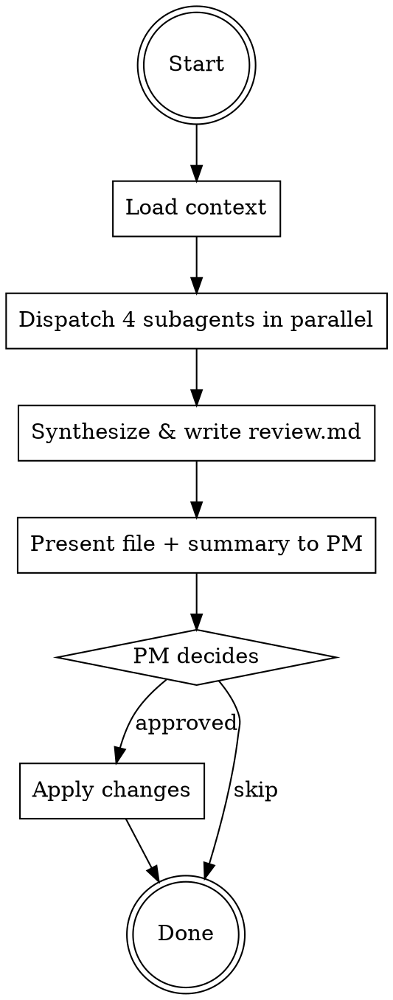

# Review PRD

Multi-perspective PRD review using parallel subagents. Four roles review independently, then a synthesizer resolves conflicts and prioritizes actionable changes.

## When to Use

- PRD draft is complete and ready for review
- After `/sync-prd` has incorporated latest changes
- Before engineering spec begins

Do NOT use when PRD is still being drafted — use `/new-prd` instead.

## Rules

- Respond in Traditional Chinese
- PM (human) is the final decision-maker — all suggestions require PM approval before modifying anything

## Workflow



### Step 1: Load Context

If PM didn't specify which PRD, list active PRDs in `prds/` (excluding `archive/`) and ask.

Read all of:
1. Target PRD — `prds/{name}/prd.md`
2. Evaluation report — `prds/{name}/evaluation.md` (if exists)
3. Product Spec — `specs/{domain}/spec.md` (if exists). Domain is typically stated in the PRD's Background section or can be inferred from the feature area (e.g., journey, broadcast, audience).
4. Same-domain active PRDs — scan `prds/` for overlap/conflict candidates
5. Test cases — `prds/{name}/test-cases.md` (if exists)

### Step 2: Parallel 4-Role Review

Dispatch 4 subagents using the Agent tool **in parallel** (all in a single message). Each subagent prompt MUST include the full PRD content, relevant spec content, other active PRDs in the same domain (if any), and instruction to output findings with severity (Must Fix / Should Fix / Nice to Have).

#### Role Definitions

| Role | Focus Area | Key Checks |
|------|-----------|------------|
| **PM** | Product completeness | Problem clarity, user stories coverage, success metrics measurability, scope boundaries, goals vs non-goals, evaluation alignment, **cross-PRD overlap/conflicts** |
| **Eng** | Technical feasibility | Spec delta vs existing spec conflicts (line-by-line), edge cases, dependencies, performance implications, security, data model gaps, race conditions, **data privacy / compliance implications** (GDPR profiling, data retention, consent) |
| **QA** | Testability | Acceptance criteria specificity, missing test scenarios (happy/edge/error), GIVEN/WHEN/THEN clarity, ambiguous requirements that block pass/fail judgment |
| **PD** | User experience | Flow intuitiveness, missing UI states (loading/error/empty), consistency with existing product, interaction details needing design specs, accessibility |

#### Subagent Prompt Template

For each role, use this structure:

```
You are a {Role} reviewing a PRD. Focus ONLY on {Focus Area}.

[Paste PRD content here]
[Paste relevant spec content here]
[Paste other active PRDs if any]

Review this PRD from your role's perspective. For each finding:
1. State the issue clearly
2. Reference the specific PRD section/line
3. Classify severity: Must Fix / Should Fix / Nice to Have
4. Provide a concrete suggestion

Output format:
### Must Fix
1. ...

### Should Fix
1. ...

### Nice to Have
1. ...

Respond in Traditional Chinese.
```

### Step 3: Synthesize & Write review.md

After all 4 subagents return, synthesize their results AND write the full review to `prds/{name}/review.md` so PM can read it at their own pace and/or sync it to Google Doc.

**Synthesis rules:**
- If multiple roles flag the same issue, merge into one entry and note the consensus
- If roles disagree, surface the conflict explicitly in the Conflicts table
- Deduplicate — same issue should not appear twice
- Tag each item with the originating role(s) for traceability

**`review.md` file format** (use `Write` tool):

```markdown
---
title: "{PRD 標題} — PRD Review"
prd: prd.md
created: YYYY-MM-DD
reviewers: [PM Agent, Eng Agent, QA Agent, PD Agent]
---

# {PRD 標題} — PRD Review

> **PRD:** [prd.md](prd.md) | **Evaluation:** [evaluation.md](evaluation.md)（如有）

## Review 結果

### 共識（2+ 個 role 獨立發現）
- ...

### 衝突
| 議題 | 角色意見 | 建議 |
|------|---------|------|
| ... | PM: ... / Eng: ... / QA: ... / PD: ... | ... |

### 修改建議（依優先級排序）

#### 🔴 Must Fix（必須修改才能進入開發）
1. **[{source role(s)}] {issue title}** — {section/line ref} — {suggestion}

#### 🟡 Should Fix（建議修改）
1. ...

#### 🟢 Nice to Have（可選修改）
1. ...

### 新增 Open Questions
- [ ] ...

---

## 附錄：各 Role 原始觀點

保留 4 個 subagent 的完整輸出，讓 PM 可追溯每項 finding 的原始 context。

### 🎯 PM Agent — 產品完整性
（subagent 完整輸出）

### 🔧 Eng Agent — 技術可行性
（subagent 完整輸出）

### ✅ QA Agent — 可測試性
（subagent 完整輸出）

### 🎨 PD Agent — 使用體驗
（subagent 完整輸出）
```

**Format notes:**
- Frontmatter aligns with existing archive convention (`prds/archive/*/review.md`)
- Keep markdown simple — avoid heavy nesting and exotic syntax, so `sync-gdoc` can convert cleanly
- Tables stay compact
- Appendix preserves raw role output verbatim for traceability

### Step 4: Present & Human Gate

After writing `review.md`, present a **short** summary to PM in the chat — do NOT paste the full synthesis. Format:

```
已產生 review 檔案：[review.md](prds/{name}/review.md)

**摘要**
- 🔴 Must Fix: N 項
- 🟡 Should Fix: N 項
- 🟢 Nice to Have: N 項
- 新增 Open Questions: N 項

{一行 highlight：最關鍵的 2-3 個議題點到即可}

請檢視 review.md 後告訴我要 apply 哪些（可分批回覆）。需要的話也可以 `/sync-gdoc` 同步到 Google Doc 討論。
```

Then wait for PM. **Do NOT modify the PRD until PM explicitly approves changes.** Apply only PM-approved changes.

PM may take multiple turns to go through the file and can approve items in batches. That is expected and desirable — the whole point of writing to a file is to decouple review ingestion from reply timing.

## Common Mistakes

| Mistake | Fix |
|---------|-----|
| Running roles sequentially in main context | Use parallel subagents — prevents cross-contamination between perspectives |
| Skipping spec delta cross-check | Eng role MUST line-by-line compare spec delta against existing specs |
| Presenting raw subagent output to PM | Always synthesize first — deduplicate, resolve conflicts, prioritize |
| Skipping the `review.md` write step | Step 3 MUST write the full synthesis (and role appendix) to `prds/{name}/review.md` before replying to PM. The chat summary is intentionally short — PM needs the file to read at their own pace or sync to gdoc |
| Pasting full synthesis in chat | After writing `review.md`, the chat reply should be a short summary only (counts + 2-3 highlights + file link) — not the full priority list |
| Modifying PRD without PM approval | Human Gate is mandatory — present findings, wait for decisions |
| Ignoring cross-PRD conflicts | PM role MUST scan other active PRDs in same domain |
| Forgetting evaluation.md alignment check | PM role MUST verify PRD direction matches original evaluation conclusions |
