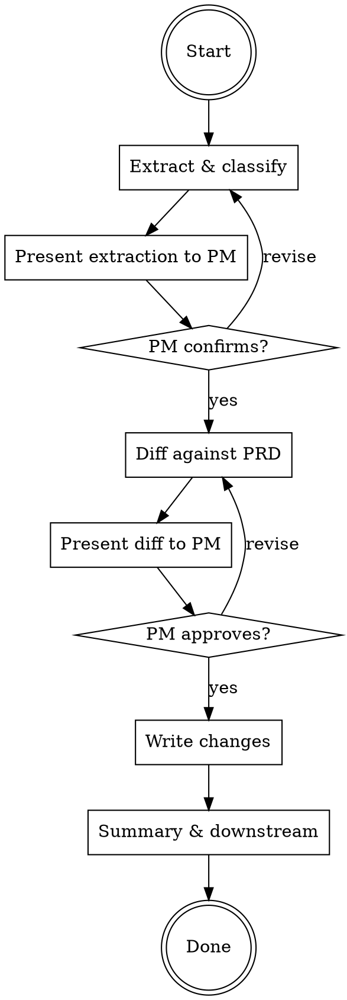
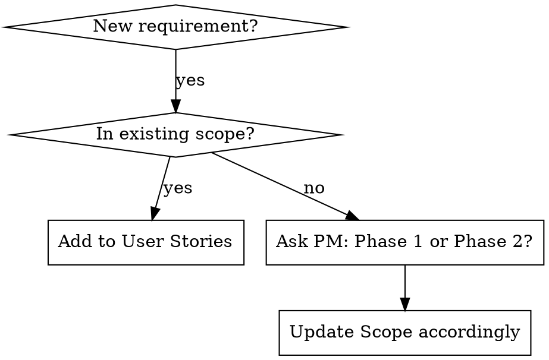

# Sync PRD

Sync external information (meeting notes, Slack threads, verbal decisions) into a PRD. The PRD is the project's SSOT — every decision must land here.

## Rules

- Respond in Traditional Chinese
- Only modify affected sections — do NOT rewrite the entire PRD
- Every change must be confirmed by PM before writing to file
- Always explain WHAT changed and WHY

## Workflow



### Step 1: Identify Target PRD

If PM didn't specify which PRD, list active PRDs in `prds/` (excluding `archive/`) and ask.

Read:
1. `prds/{name}/prd.md`
2. `specs/{domain}/spec.md` (if exists) — for conflict detection

### Step 2: Extract & Classify

Parse PM's input into exactly these 5 categories. Present as a structured table:

| Category | Description | How to identify |
|----------|-------------|-----------------|
| **Decisions** | Things confirmed to do or not do | "decided", "confirmed", "agreed" |
| **New Requirements** | Features/behaviors not in current PRD | Not found in User Stories or Scope |
| **Scope Changes** | In/Out Scope boundary shifts | Moves between In Scope ↔ Out of Scope |
| **Question Answers** | Existing Open Questions now resolved | Matches an item in Open Questions |
| **New Questions** | Unknowns raised during discussion | "need to check", "TBD", "待確認" |

**Present extraction to PM and wait for confirmation before proceeding.**

This is a human gate. Do NOT proceed to Step 3 until PM says the extraction is correct.

### Step 3: Diff Against Current PRD

For each extracted item, identify:
- Which PRD section(s) it affects
- Whether it **conflicts** with existing content (flag explicitly)
- Whether it affects **cross-cutting concerns** (scope, architecture, dependencies, timeline)

New requirements need special handling:



**Never guess whether a new requirement is in scope.** Ask the PM explicitly: "This is a new requirement not in the original PRD. Is it Phase 1 (In Scope) or Phase 2 (Out of Scope)?"

Present the full diff to PM:

```markdown
## Proposed Changes

### Conflicts (requires decision)
- {section}: current says X, new info says Y — which is correct?

### Updates
| # | Section | Current | Proposed | Source |
|---|---------|---------|----------|--------|
| 1 | ... | ... | ... | Decision/New Req/etc |

### New Open Questions
- [ ] {question}

### Open Questions to Close
- [x] {question} — Answer: {answer}
```

**Wait for PM approval before writing.**

### Step 4: Write Changes

Apply PM-approved changes to the PRD. Update mapping:

| Information Type | PRD Section(s) |
|-----------------|----------------|
| Decisions | Goals/Non-Goals, Proposed Solution, Decision Log |
| New Requirements | User Stories, Scope, Proposed Solution |
| Scope Changes | Scope (In/Out) |
| Question Answers | Open Questions (mark resolved) |
| New Questions | Open Questions (add new) |

Always update:
- Frontmatter `updated` date
- Decision Log with date, decision, and context

### Step 5: Summary & Downstream Reminders

Output:

```markdown
## Sync Summary
- Source: {meeting / Slack / other}
- Updated: {list of modified sections}
- New Open Questions: {if any}
- Closed Open Questions: {if any}
```

If updates affect User Stories, Acceptance Criteria, or Spec Delta, remind PM:

> PRD requirements changed. Consider re-running:
> - `/gen-test-cases` — regenerate test cases
> - `/gen-release-notes` — update release notes
> - `/review-prd` — re-review if changes are significant

## Common Mistakes

| Mistake | Fix |
|---------|-----|
| Editing PRD without PM confirmation | TWO human gates: after extraction AND after diff |
| Guessing scope for new requirements | Always ask PM: "Phase 1 or Phase 2?" |
| Missing conflicts with existing content | Cross-reference new info against current PRD line by line |
| Forgetting downstream reminders | Always check if User Stories/AC/Spec Delta were touched |
| Cramming new requirement into a vague "TBD" section | Classify it properly — it's either In Scope or Out of Scope |
| Updating without adding to Decision Log | Every sync adds at least one Decision Log entry |

## Red Flags — STOP and Re-read This Skill

- You're about to edit the PRD without showing PM the diff first
- You're putting a new requirement in a "待定" limbo instead of asking about scope
- You're skipping the extraction step because "it's obvious"
- You're not checking for conflicts because "the changes are small"
- You finished the sync without mentioning downstream impacts

**All of these mean: Go back to the workflow. Follow the steps.**
